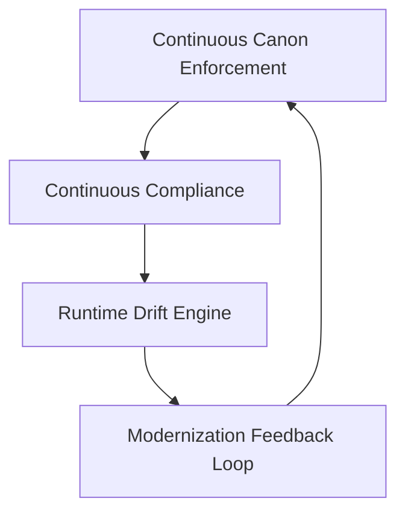

<!-- NEW (Proposed) -->
# Phase 5 — Operational Governance & Runtime Enforcement

> **Status:** NEW (Proposed)  
> **Version:** 0.1.0  
> **Last Updated:** 2026-03-26  

---

## 1. Overview

Phase 5 establishes the **Operational Governance Layer** — the always-on enforcement mechanism that transforms UIAO from a static canon into a self-governing, telemetry-driven, continuously compliant architecture.

### Responsibilities

- Continuous canon enforcement
- Continuous compliance validation
- Runtime drift detection
- Telemetry-driven governance
- Modernization feedback loops
- Automation-anchored integrity

---

## 2. Phase 5 Pillars

### Pillar 1 — Continuous Canon Enforcement

Ensures the 12 canonical documents remain correct, contiguous, unmodified without governance, schema-valid, and directory-valid.

| Output | Description |
|---|---|
| Canon Integrity Report | Validates all 12 documents against schema |
| Numbering Validator | Ensures 00-11 sequence integrity |
| Schema Validator | Validates document metadata |
| Directory Validator | Ensures layout per Document 10 |

### Pillar 2 — Continuous Compliance

Ensures alignment with FedRAMP 20x, NIST SP 800-53 Rev 5, NIST SP 800-63, TIC 3.0, and SCuBA.

| Output | Description |
|---|---|
| Compliance Drift Report | Identifies control gaps |
| Crosswalk Validation Engine | Validates mappings |
| Evidence Source Map | Links telemetry to controls |

### Pillar 3 — Runtime Telemetry & Drift Detection

Monitors Identity, Addressing, Certificate, Telemetry, Overlay, and CMDB drift.

| Output | Description |
|---|---|
| Runtime Drift Model | Defines drift categories and remediation |
| Telemetry Evidence Map | Maps telemetry sources to controls |
| Drift Event Log | Records drift events |

### Pillar 4 — Modernization Feedback Loop

Creates a closed loop between modernization tasks, governance, leadership, and canon updates.

| Output | Description |
|---|---|
| Modernization Feedback Report | Tracks task-to-governance alignment |
| Governance-to-Canon Sync Rules | Defines how governance triggers canon updates |
| Canon-to-Modernization Sync Rules | Defines how canon changes trigger modernization |

---

## 3. Phase 5 Output Artifacts

| # | Artifact | File | Status |
|---|---|---|---|
| 1 | Operational Governance Charter | This document | NEW (Proposed) |
| 2 | Runtime Drift Model | `PHASE5_RuntimeDriftModel.md` | NEW (Proposed) |
| 3 | Continuous Compliance Engine Spec | `PHASE5_ContinuousComplianceEngine.md` | NEW (Proposed) |
| 4 | Telemetry Evidence Map | `PHASE5_TelemetryEvidenceMap.md` | NEW (Proposed) |
| 5 | Automation Enforcement Matrix | `PHASE5_AutomationEnforcementMatrix.md` | NEW (Proposed) |

---

## 4. Architecture Diagram

```
PHASE 5 — OPERATIONAL GOVERNANCE LAYER
---------------------------------------
     +----------------------------+
     | Continuous Canon Enforcement|
     +-------------+--------------+
                   |
     +-------------v--------------+
     | Continuous Compliance       |
     | (FedRAMP, NIST, TIC 3.0)   |
     +-------------+--------------+
                   |
     +-------------v--------------+
     | Runtime Drift Engine        |
     | (Identity, Addressing,      |
     |  Telemetry, Certificates)   |
     +-------------+--------------+
                   |
     +-------------v--------------+
     | Modernization Feedback Loop |
     +----------------------------+
```

---

## 5. Governance Flow (Mermaid)



---

## 6. Integration with UIAO Canon

| Canon Group | Documents | Phase 5 Role |
|---|---|---|
| Architecture | 00-02 | Defines what Phase 5 enforces |
| Compliance | 03-05 | Defines what Phase 5 validates |
| Leadership | 06-08 | Defines what Phase 5 feeds |
| Metadata | 09-11 | Defines what Phase 5 uses |

---

## 7. Readiness Checklist

- [ ] Canon validators operational
- [ ] Compliance engine operational
- [ ] Drift detection operational
- [ ] Telemetry evidence map defined
- [ ] Governance charter approved
- [ ] Feedback loop connected to modernization tasks
- [ ] Automation scaffolding integrated

---

## 8. Related Documents

| Document | Location |
|---|---|
| Runtime Drift Model | `docs/PHASE5_RuntimeDriftModel.md` |
| Continuous Compliance Engine | `docs/PHASE5_ContinuousComplianceEngine.md` |
| Telemetry Evidence Map | `docs/PHASE5_TelemetryEvidenceMap.md` |
| Automation Enforcement Matrix | `docs/PHASE5_AutomationEnforcementMatrix.md` |
