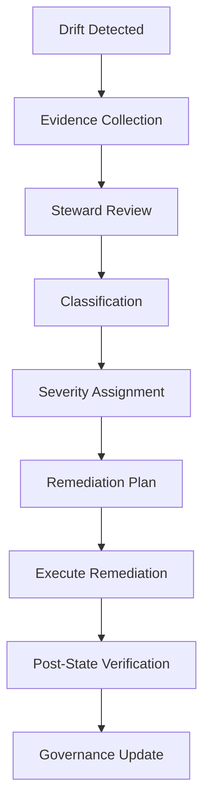

<!-- STATUS: Promoted to numbered canon. See 16_DriftDetectionStandard.md for the authoritative version. This document retained for operational runtime detail. -->

---
title: "Phase5 Runtimedriftmodel"
author: "UIAO Modernization Program"
date: today
date-format: "MMMM D, YYYY"
format:
  html: default
  docx: default
  pdf: default
  gfm: default
---

# PHASE 5 — Runtime Drift Model

> **UIAO Control Plane — Sequence D: Canon Expansion & Runtime Integration**
>
> Version: 2.0 
> Date: 2026-03-26 
> Classification: **CUI** — Executive Use Only 
> Status: **NEW (Proposed)** 
> Artifact: Task D2 
> Protocol: NO-HALLUCINATION PROTOCOL 
> Mode: Proposal Mode (B) 
> Parent: `PHASE5_OperationalGovernance.md`

---

## 1. Purpose of the Runtime Drift Model

**NEW (Proposed)**

The Runtime Drift Model defines:

- What drift is
- How drift is classified
- How drift is detected
- How drift is validated
- How drift is remediated
- How drift feeds governance
- How drift affects the canon

The Runtime Drift Model ensures that the UIAO runtime remains:

| Property | Description |
|---|---|
| Aligned | Runtime matches canonical architecture |
| Predictable | Behavior conforms to documented expectations |
| Secure | No unauthorized deviations from security posture |
| Compliant | FedRAMP, NIST, TIC 3.0, SCuBA controls enforced |
| Governed | All drift events enter the governance lifecycle |
| Evidence-backed | Every drift event is supported by telemetry |

It defines the **runtime truth model** against which all operational data is compared.

This is the operational backbone of Phase 5.

---

## 2. Drift Domains

**NEW (Proposed)**

UIAO recognizes six drift domains, aligned to the control planes and runtime model:

| Domain | Control Plane | Runtime Scope |
|---|---|---|
| Identity Drift | Identity (Entra ID) | Conditional Access, MFA, lifecycle, RBAC, stale accounts |
| Addressing Drift | Addressing (IPAM) | Subnet allocation, DNS resolution, IP conflicts, rogue devices |
| Certificate Drift | Certificates (PKI) | Expiration, rotation, unauthorized issuance, CA integrity |
| Overlay Drift | Network (Overlay) | TIC 3.0 compliance, micro-segmentation, routing tables |
| Telemetry Drift | Telemetry | Log collection gaps, SIEM disconnection, retention violations |
| CMDB Drift | CMDB | Unauthorized assets, baseline deviation, ghost entries |

These domains map directly to the runtime sequence:

```
Identity → Addressing → Certificates → Overlay → Telemetry → Policy
```

---

## 3. Drift Categories

**NEW (Proposed)**

Each drift event is classified into one of four categories:

| Category | Designation | Description | Example |
|---|---|---|---|
| Configuration Drift | Category A | Mismatch between expected and actual configuration | Conditional Access policy missing MFA requirement |
| State Drift | Category B | Mismatch between expected and actual runtime state | Certificate expired but service still running |
| Evidence Drift | Category C | Missing, stale, or contradictory telemetry | SIEM log gap exceeding 1 hour |
| Canon Drift | Category D | Runtime behavior contradicts the canonical architecture | Overlay routing bypasses TIC 3.0 boundary |

---

## 4. Drift Severity Levels

**NEW (Proposed)**

| Level | Name | Description | Response Time | Escalation |
|---|---|---|---|---|
| Level 1 | Informational | Minor deviation, no impact | 72 hours | Domain Owner |
| Level 2 | Warning | Potential impact, requires triage | 24 hours | Domain Owner + Runtime Steward |
| Level 3 | Critical | Active impact on compliance or security | 4 hours | Runtime Steward + ISSO |
| Level 4 | Canon-Breaking | Runtime contradicts the canonical architecture | 1 hour | Runtime Steward + ISSO + AO |

---

## 5. Drift Detection Methods

**NEW (Proposed)**

Drift is detected through **continuous** methods, not periodic reviews:

| Detection Method | Type | Source | Domain(s) |
|---|---|---|---|
| Scheduled scans | Automated | `detect_drift.py`, cron workflows | All |
| Event-based triggers | Automated | Azure Monitor, webhook events | Identity, Certificates |
| Telemetry anomalies | Automated | SIEM correlation, log analysis | Telemetry, All |
| Identity logs | Automated | Entra ID sign-in / audit logs | Identity |
| Addressing tables | Automated | IPAM reconciliation scripts | Addressing |
| Certificate metadata | Automated | `cert_monitor.py`, PKI logs | Certificates |
| Overlay routing tables | Automated | TIC 3.0 validation scripts | Overlay |
| CMDB deltas | Automated | `cmdb_baseline.py`, change detection | CMDB |
| Compliance evidence gaps | Automated | Compliance automation pipeline | All |
| Automation validators | Automated | `tools/validators/` | Canon, All |

---

## 6. Drift Validation Pipeline

**NEW (Proposed)**

```
Detection → Evidence Collection → Steward Review → Classification → Severity Assignment → Remediation Plan → Governance Update
```

| Stage | Actor | Tool | Output |
|---|---|---|---|
| 1. Detection | Automation | Scheduled scans, event triggers | Raw drift alert |
| 2. Evidence Collection | Automation | Telemetry, logs, metadata, CMDB | Evidence package |
| 3. Steward Review | Runtime Steward | Manual assessment | Validated drift event |
| 4. Classification | Runtime Steward | Category A/B/C/D assignment | Classified event |
| 5. Severity Assignment | Runtime Steward | Level 1/2/3/4 assignment | Severity-tagged event |
| 6. Remediation Plan | Domain Owner | Remediation strategy | Approved plan |
| 7. Governance Update | Automation + Steward | Governance lifecycle integration | Closed-loop record |

This pipeline ensures:

- No false positives act on the runtime
- No unverified drift enters governance
- No ungoverned remediation occurs

---

## 7. Drift Remediation Model

**NEW (Proposed)**

Remediation follows a structured six-step path:

| Step | Action | Details |
|---|---|---|
| 1. Identify Source | Determine drift domain | Identity, addressing, certificate, overlay, telemetry, or CMDB |
| 2. Validate Evidence | Confirm with telemetry | Logs, metadata, CMDB entries, compliance evidence |
| 3. Determine Type | Select remediation type | See remediation types below |
| 4. Execute | Manual or automated | Based on severity and domain |
| 5. Verify Post-State | Confirm drift resolved | Re-run detection, compare expected vs. actual |
| 6. Update Governance | Feed results into Phase 5 | Close drift event, update governance outputs |

### Remediation Types

| Type | Applies To | Example |
|---|---|---|
| Configuration correction | Category A drift | Re-apply Conditional Access policy |
| State reset | Category B drift | Restart service with valid certificate |
| Certificate regeneration | Certificate drift | Emergency certificate renewal |
| Addressing reallocation | Addressing drift | Resolve IP conflict, update IPAM |
| Telemetry restoration | Telemetry drift | Reconnect SIEM, backfill log gap |
| Canon update | Category D drift (rare) | Update canonical document to reflect justified change |

---

## 8. Drift Event Structure (Schema)

**NEW (Proposed)**

```yaml
drift_event:
  id: <uuid>
  timestamp: <iso8601>
  domain: <identity|addressing|certificate|overlay|telemetry|cmdb>
  category: <configuration|state|evidence|canon>
  severity: <1|2|3|4>
  expected_state: <object>
  actual_state: <object>
  evidence_sources:
    - <telemetry>
    - <logs>
    - <metadata>
    - <cmdb>
  remediation:
    type: <manual|automated>
    steps: <list>
  status: <open|in-progress|resolved>
  governance:
    steward: <string>
    reviewed: <iso8601>
    closed: <iso8601|null>
```

This schema is ready for automation and integrates with the `tools/schema/` directory.

---

## 9. Drift-to-Governance Integration

**NEW (Proposed)**

Every drift event feeds the governance lifecycle defined in Task D1:

| Drift Severity | Governance Action | Output |
|---|---|---|
| Level 1 | Logged, included in weekly report | Runtime Drift Report |
| Level 2 | Triaged, remediation tracked | Runtime Drift Report + POA&M |
| Level 3 | Escalated, ISSO notified, compliance impact assessed | Compliance Drift Report + POA&M |
| Level 4 | AO notified, canon review triggered, potential canon update | Canon Integrity Report + Governance Review |

---

## 10. Drift Model Summary (ASCII)

**NEW (Proposed)**

```
RUNTIME DRIFT MODEL
───────────────────────────────────────────────
Domains:
  Identity
  Addressing
  Certificates
  Overlay
  Telemetry
  CMDB

Categories:
  A — Configuration
  B — State
  C — Evidence
  D — Canon

Severity:
  1 → Informational
  2 → Warning
  3 → Critical
  4 → Canon-Breaking

Pipeline:
  Detect → Validate → Classify → Remediate → Verify → Govern
───────────────────────────────────────────────
```

---

## 11. Drift Flow (Mermaid)

**NEW (Proposed)**


<details>
<summary>Mermaid source</summary>


<details>
<summary>Mermaid source</summary>


<details>
<summary>Mermaid source</summary>


<details>
<summary>Mermaid source</summary>


<details>
<summary>Mermaid source</summary>


<details>
<summary>Mermaid source</summary>


<details>
<summary>Mermaid source</summary>


<details>
<summary>Mermaid source</summary>


<details>
<summary>Mermaid source</summary>


<details>
<summary>Mermaid source</summary>


<details>
<summary>Mermaid source</summary>



</details>

</details>

</details>

</details>

</details>

</details>

</details>

</details>

</details>

</details>

</details>

---

## 12. References

| Reference | Description |
|---|---|
| `docs/PHASE5_OperationalGovernance.md` | Operational Governance Charter (Task D1) |
| `docs/00_ControlPlaneArchitecture.md` | Control Plane architecture (Document 00) |
| `docs/01_UnifiedArchitecture.md` | Unified Architecture (Document 01) |
| `docs/09_CrosswalkIndex.md` | Crosswalk Index (Document 09) |
| `scripts/detect_drift.py` | Drift detection script |
| `scripts/cert_monitor.py` | Certificate monitoring script |
| `scripts/cmdb_baseline.py` | CMDB baseline script |
| `scripts/reconcile_ipam.py` | IPAM reconciliation script |
| `tools/validators/` | Schema and structure validators |
| `.github/ISSUE_TEMPLATE/governance-drift-report.yml` | Drift report issue template |
| `.github/workflows/` | Automation enforcement workflows |

---

## 13. Approval

| Role | Name | Date |
|---|---|---|
| Document Author | UIAO Program Team | 2026-03-26 |
| Runtime Steward | _________________ | __________ |
| Canon Steward | _________________ | __________ |
| ISSO Approval | _________________ | __________ |
| AO Approval | _________________ | __________ |

---

> **NO-HALLUCINATION PROTOCOL**: All drift domains, categories, severity levels, and detection methods are derived from the canonical UIAO control plane architecture, existing automation scaffolding, and Phase 5 pillars. The runtime sequence (Identity → Addressing → Certificates → Overlay → Telemetry → Policy) is sourced from the control plane model. No external sources were hallucinated. All content is **NEW (Proposed)** pending approval.
