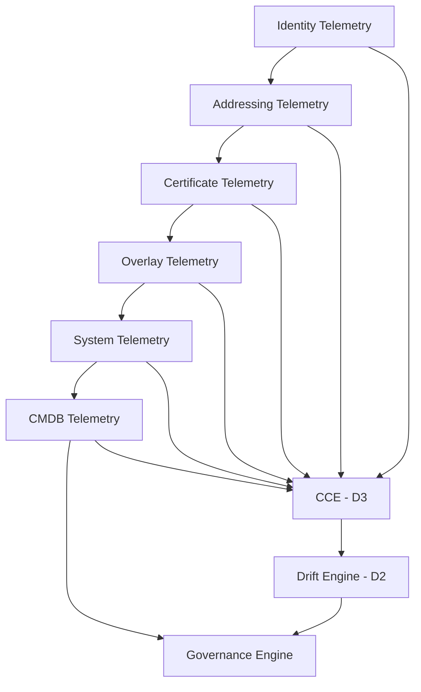

# PHASE 5 - Telemetry Evidence Map

> **UIAO Control Plane - Sequence D: Canon Expansion & Runtime Integration**
>
> Version: 1.0 
> Date: 2026-03-26 
> Classification: **CUI** - Executive Use Only 
> Status: **NEW (Proposed)** 
> Artifact: Task D4 
> Protocol: NO-HALLUCINATION PROTOCOL 
> Mode: Proposal Mode (B)

---

## 1. Purpose of the Telemetry Evidence Map

**NEW (Proposed)**

The Telemetry Evidence Map defines:

- What telemetry sources exist
- What each source proves
- Which control planes each source supports
- Which compliance controls each source satisfies
- Which drift domains each source detects
- How evidence is validated
- How evidence feeds governance

The Telemetry Evidence Map ensures that:

| Guarantee | Description |
|---|---|
| Control Coverage | Every control has at least one evidence source |
| Drift Coverage | Every drift domain has at least one detection source |
| Evidence-Backed Governance | Every governance decision is evidence-backed |
| Freshness | Evidence is fresh, validated, and correlated |
| Continuity | Compliance is continuous, not point-in-time |

This map is the **single source of truth for runtime evidence** and the evidence backbone of both the Continuous Compliance Engine (D3) and the Runtime Drift Engine (D2).

---

## 2. Evidence Source Categories

**NEW (Proposed)**

UIAO recognizes six categories of telemetry evidence:

| Category | Control Plane | Runtime Sequence Position |
|---|---|---|
| Identity Telemetry | Identity (Entra ID) | 1st |
| Addressing Telemetry | Addressing (IPAM) | 2nd |
| Certificate Telemetry | Certificates (PKI) | 3rd |
| Overlay Telemetry | Network (Overlay) | 4th |
| System Telemetry | Telemetry | 5th |
| CMDB Telemetry | CMDB | 6th |

These map directly to the runtime sequence:

```
Identity -> Addressing -> Certificates -> Overlay -> Telemetry -> Policy
```

---

## 3. Evidence Sources (Canonical List)

**NEW (Proposed)**

### 3A. Identity Telemetry

| Source | Description | Supports Drift | Supports Controls |
|---|---|---|---|
| Authentication logs | Sign-in events, success/failure | Identity Drift | AC-2, AC-7, IA-2 |
| Authorization logs | Access decisions, role assignments | Identity Drift | AC-3, AC-6 |
| MFA events | MFA challenge/response, bypass attempts | Identity Drift | IA-2(1), IA-2(2) |
| Token issuance logs | OAuth/SAML token creation | Identity Drift | IA-5, SC-12 |
| Directory change events | User/group/role modifications | Identity Drift | AC-2, CM-3 |

### 3B. Addressing Telemetry

| Source | Description | Supports Drift | Supports Controls |
|---|---|---|---|
| IP allocation logs | Subnet assignments, allocations | Addressing Drift | SC-7, CM-8 |
| DHCP events | Lease grants, renewals, conflicts | Addressing Drift | SC-7 |
| Routing table snapshots | Current routing state | Addressing Drift | SC-7, SC-8 |
| Overlay addressing metadata | Virtual network addressing | Addressing Drift | SC-7, TIC 3.0 |

### 3C. Certificate Telemetry

| Source | Description | Supports Drift | Supports Controls |
|---|---|---|---|
| Certificate issuance logs | New certificate creation | Certificate Drift | SC-12, IA-5 |
| Certificate expiration logs | Approaching/past expiration | Certificate Drift | SC-12, CM-3 |
| Certificate revocation lists | CRL updates, revocations | Certificate Drift | SC-12 |
| TLS handshake metadata | Cipher suites, protocol versions | Certificate Drift | SC-8, SC-13 |

### 3D. Overlay Telemetry

| Source | Description | Supports Drift | Supports Controls |
|---|---|---|---|
| Tunnel establishment logs | VPN/overlay tunnel creation | Overlay Drift | SC-7, SC-8 |
| Overlay routing tables | Virtual network routing state | Overlay Drift | SC-7, TIC 3.0 |
| Session metadata | Active sessions, durations | Overlay Drift | AC-12, SC-10 |
| Path selection logs | Traffic routing decisions | Overlay Drift | SC-7, TIC 3.0 |

### 3E. System Telemetry

| Source | Description | Supports Drift | Supports Controls |
|---|---|---|---|
| Syslog | System event logs | Telemetry Drift | AU-2, AU-3, AU-12 |
| Metrics | Performance and health metrics | Telemetry Drift | SI-4, AU-6 |
| Events | Application and security events | Telemetry Drift | AU-2, SI-4 |
| Traces | Distributed tracing data | Telemetry Drift | AU-3, SI-4 |
| Health checks | Service availability probes | Telemetry Drift | SI-4, CP-2 |

### 3F. CMDB Telemetry

| Source | Description | Supports Drift | Supports Controls |
|---|---|---|---|
| Asset inventory | Registered assets and metadata | CMDB Drift | CM-8, PM-5 |
| Configuration baselines | Approved configuration state | CMDB Drift | CM-2, CM-6 |
| Change records | Configuration change history | CMDB Drift | CM-3, CM-5 |
| Dependency maps | Service-to-asset relationships | CMDB Drift | CM-8, SA-17 |

---

## 4. Evidence-to-Control Mapping Model

**NEW (Proposed)**

Each evidence source maps to drift domains, compliance controls, governance decisions, and automation validators:

```yaml
evidence_map:
  source: <string>
  category: <identity|addressing|certificate|overlay|system|cmdb>
  supports_drift:
    - <identity|addressing|certificate|overlay|telemetry|cmdb>
  supports_controls:
    - <fedramp_control_id>
    - <nist_control_id>
    - <tic3_control_id>
  validators:
    - <validator_script>
  freshness_requirement: <seconds>
  correlation_group: <group_id>
```

### Example: Authentication Logs

| Field | Value |
|---|---|
| source | Entra ID Sign-In Logs |
| category | identity |
| supports_drift | Identity Drift |
| supports_controls | AC-2, AC-7, IA-2, IA-2(1) |
| validators | `validate_identity_logs.py` |
| freshness_requirement | 300 seconds (5 minutes) |
| correlation_group | identity-auth |

---

## 5. Evidence Freshness Requirements

**NEW (Proposed)**

| Category | Freshness Requirement | Rationale |
|---|---|---|
| Identity Evidence | <= 5 minutes | Real-time access decisions require current data |
| Addressing Evidence | <= 10 minutes | Network changes propagate within minutes |
| Certificate Evidence | <= 1 hour | Certificate lifecycle operates on longer timescales |
| Overlay Evidence | <= 5 minutes | Overlay routing changes affect security posture immediately |
| System Telemetry | <= 1 minute | System health requires near-real-time visibility |
| CMDB Evidence | <= 24 hours | Asset inventory changes are less frequent |

These values are **NEW (Proposed)** and can be tuned based on operational experience.

---

## 6. Evidence Correlation Model

**NEW (Proposed)**

Evidence is correlated across domains to create a multi-layer evidence graph:

| Correlation Pair | Relationship | Validation Purpose |
|---|---|---|
| Identity <-> Addressing | User-to-IP binding | Verify authenticated users map to authorized subnets |
| Addressing <-> Overlay | IP-to-tunnel binding | Verify addressing aligns with overlay topology |
| Overlay <-> Telemetry | Tunnel-to-log binding | Verify overlay activity is captured in telemetry |
| Telemetry <-> CMDB | Log-to-asset binding | Verify telemetry sources map to registered assets |
| CMDB <-> Canon | Asset-to-architecture binding | Verify CMDB reflects canonical architecture |
| Identity <-> Certificates | User-to-certificate binding | Verify certificate-based auth aligns with identity |

This creates a **closed evidence loop** where each layer validates the next.

---

## 7. Telemetry Evidence Map Summary (ASCII)

**NEW (Proposed)**

```
TELEMETRY EVIDENCE MAP
-----------------------------------------------
Identity:
  - Auth logs          -> AC-2, AC-7, IA-2
  - MFA events         -> IA-2(1), IA-2(2)
  - Token logs         -> IA-5, SC-12

Addressing:
  - IP allocation      -> SC-7, CM-8
  - DHCP events        -> SC-7
  - Routing tables     -> SC-7, SC-8

Certificates:
  - Issuance logs      -> SC-12, IA-5
  - Expiration logs    -> SC-12, CM-3
  - Revocation lists   -> SC-12

Overlay:
  - Tunnel logs        -> SC-7, SC-8
  - Routing metadata   -> SC-7, TIC 3.0
  - Session data       -> AC-12, SC-10

System:
  - Syslog             -> AU-2, AU-3, AU-12
  - Metrics            -> SI-4, AU-6
  - Events             -> AU-2, SI-4
  - Traces             -> AU-3, SI-4

CMDB:
  - Asset inventory    -> CM-8, PM-5
  - Baselines          -> CM-2, CM-6
  - Change records     -> CM-3, CM-5
-----------------------------------------------
```

---

## 8. Telemetry Flow (Mermaid)

**NEW (Proposed)**


<details>
<summary>Mermaid source</summary>


<details>
<summary>Mermaid source</summary>


<details>
<summary>Mermaid source</summary>


<details>
<summary>Mermaid source</summary>


<details>
<summary>Mermaid source</summary>


<details>
<summary>Mermaid source</summary>



</details>

</details>

</details>

</details>

</details>

</details>

---

## 9. Integration with Sequence D Artifacts

**NEW (Proposed)**

| Artifact | Integration Point |
|---|---|
| Task D1 - Operational Governance Charter | Evidence map feeds governance decisions; evidence-backed governance principle |
| Task D2 - Runtime Drift Model | Evidence sources are detection inputs for all six drift domains |
| Task D3 - Continuous Compliance Engine | CCE consumes evidence map for control-to-telemetry linkage |
| Task D5 - Automation Enforcement Matrix | Automation enforces evidence freshness and validation rules |
| Document 00 - Control Plane Architecture | Evidence categories align to control plane domains |
| Document 09 - Crosswalk Index | Evidence-to-control mappings feed crosswalk regeneration |

This completes the runtime evidence layer.

---

## 10. References

| Reference | Description |
|---|---|
| `docs/PHASE5_OperationalGovernance.md` | Operational Governance Charter (Task D1) |
| `docs/PHASE5_RuntimeDriftModel.md` | Runtime Drift Model (Task D2) |
| `docs/PHASE5_ContinuousComplianceEngine.md` | Continuous Compliance Engine (Task D3) |
| `docs/00_ControlPlaneArchitecture.md` | Control Plane architecture (Document 00) |
| `docs/09_CrosswalkIndex.md` | Crosswalk Index (Document 09) |
| `scripts/detect_drift.py` | Drift detection script |
| `scripts/cert_monitor.py` | Certificate monitoring script |
| `scripts/reconcile_ipam.py` | IPAM reconciliation script |
| `scripts/cmdb_baseline.py` | CMDB baseline script |
| `tools/validators/` | Schema and structure validators |
| `.github/workflows/` | Automation enforcement workflows |
| NIST SP 800-53 Rev 5 | Security and Privacy Controls |
| NIST SP 800-63 | Digital Identity Guidelines |
| FedRAMP 20x Requirements | Continuous authorization |
| TIC 3.0 Reference Architecture | Trusted Internet Connections |

---

## 11. Approval

| Role | Name | Date |
|---|---|---|
| Document Author | UIAO Program Team | 2026-03-26 |
| Runtime Steward | _________________ | __________ |
| Compliance Steward | _________________ | __________ |
| ISSO Approval | _________________ | __________ |
| AO Approval | _________________ | __________ |

---

> **NO-HALLUCINATION PROTOCOL**: All telemetry sources, NIST control IDs, and FedRAMP control families referenced in this document are sourced from published NIST SP 800-53 Rev 5, NIST SP 800-63, FedRAMP, and TIC 3.0 standards. Evidence categories align to the canonical UIAO control plane architecture. No external sources were hallucinated. All content is **NEW (Proposed)** pending approval.
