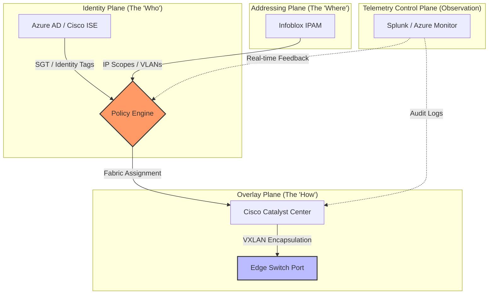

# Modernization Atlas: Unified Architecture

This document outlines the four-plane model driving the agency's IT transformation. By decoupling identity from physical location, we create a system that is both more secure and more agile.

## Architectural Convergence
The following diagram visualizes the intersection of user identity and network location.

Mermaid source

Mermaid source

Mermaid source

### Core Pillars

* **Identity Plane (The "Who"):** Azure AD and Cisco ISE provide unified identity through Security Group Tags and Conditional Access policies, feeding into the central Policy Engine.
* **Addressing Plane (The "Where"):** Infoblox IPAM delivers automated IP scope and VLAN assignment, eliminating manual spreadsheet tracking.
* **Overlay Plane (The "How"):** Cisco Catalyst Center orchestrates VXLAN fabric assignments, translating policy decisions into edge switch port configurations.
* **Telemetry Control Plane (Observation):** Splunk and Azure Monitor provide real-time feedback loops and audit logging, enabling proactive threat detection and performance optimization.

### Architectural Principles
- Identity-driven routing
- Telemetry-informed decisions
- Cloud-first path selection
- Zero Trust segmentation
- Modular, incremental modernization