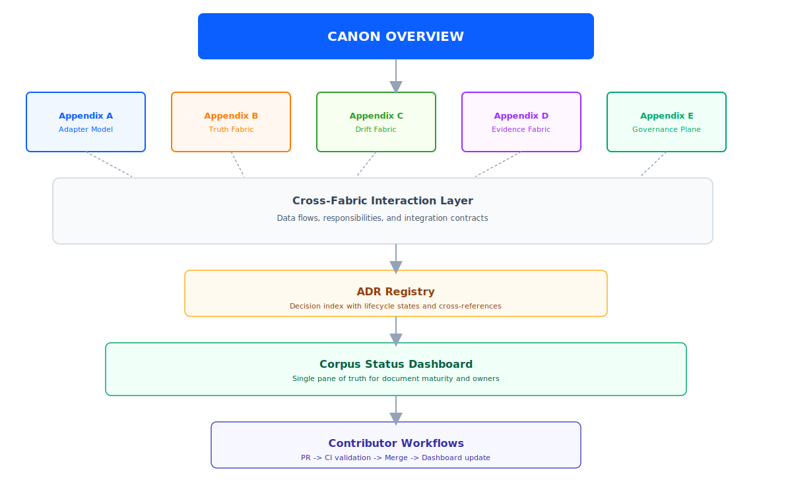

# Corpus Status Dashboard

> **Auto-generated summary.** Reflects corpus state as of last `update-corpus-index` run.
> For live counts, see `docs/_data/corpus-index.json` (generated by `scripts/update_corpus_index.js`).

## Health Summary

| Metric | Count |
|--------|-------|
| Total documents | 53 |
| Status: Current | 24 |
| Status: Draft | 29 |
| Status: Needs Replacing | 0 |
| Status: Needs Creating | 0 |
| Status: Deprecated | 0 |
| ADRs (ACCEPTED) | 23 |
| ADRs (PROPOSED) | 1 |
| CI validation | Active |

## Document Status by Section

### Canon Overview

| ID | Title | Status |
|----|-------|--------|
| UIAO_A_01 | Canonical Rules | Current |
| UIAO_A_02 | Glossary | Current |
| UIAO_A_03 | Migration Plan | Draft |
| UIAO_A_04 | PDF Layout Spec | Draft |

### Adapter Plane

| ID | Title | Status |
|----|-------|--------|
| UIAO_B_01 | Adapter Contract | Current |
| UIAO_B_02 | Adapter Framework | Current |
| UIAO_B_03 | Adapter Responsibilities Diagram Set | Draft |
| UIAO_B_04 | Database Adapters | Current |
| UIAO_B_05 | Database Adapter Drift Detection | Draft |
| UIAO_B_06 | Database Adapter Onboarding Checklist | Draft |
| UIAO_B_07 | Canonical Definition of a UIAO Adapter | Current |

### Identity Plane

| ID | Title | Status |
|----|-------|--------|
| UIAO_C_01 | Identity Plane Deep Dive | Current |
| UIAO_C_02 | Zero Trust Narrative | Current |

### Architecture

| ID | Title | Status |
|----|-------|--------|
| UIAO_D_01 | Unified Architecture | Current |
| UIAO_D_02 | Control Plane Architecture | Current |
| UIAO_D_03 | Seven Layer Model | Current |
| UIAO_D_04 | System Architecture | Draft |
| UIAO_D_05 | Authorization Boundary | Draft |

### FedRAMP / Compliance

| ID | Title | Status |
|----|-------|--------|
| UIAO_E_01 | FedRAMP 2.0x Crosswalk | Current |
| UIAO_E_02 | FedRAMP 2.0x Phase 2 Summary | Current |
| UIAO_E_03 | FedRAMP SSP Narrative (Full) | Current |
| UIAO_E_04 | Compliance Readiness | Draft |
| UIAO_E_05 | Crosswalk Index | Current |

### Evidence and Drift

| ID | Title | Status |
|----|-------|--------|
| UIAO_F_01 | Drift Detection Standard | Current |
| UIAO_F_02 | Telemetry Plane Deep Dive | Current |
| UIAO_F_03 | Telemetry Evidence Map | Draft |
| UIAO_F_04 | Reconciliation Model | Draft |

### Management and Operations

| ID | Title | Status |
|----|-------|--------|
| UIAO_G_01 | Management Stack | Current |
| UIAO_G_02 | Operational Handover | Draft |
| UIAO_G_03 | Modernization Timeline | Current |
| UIAO_G_04 | MVP Roadmap | Draft |

### Program Vision and Leadership

| ID | Title | Status |
|----|-------|--------|
| UIAO_H_01 | Program Vision | Current |
| UIAO_H_02 | Leadership Briefing | Current |
| UIAO_H_03 | Executive Summary | Current |
| UIAO_H_04 | AI Security Principles | Draft |

### Onboarding and Contributing

| ID | Title | Status |
|----|-------|--------|
| UIAO_I_01 | Contributing Guide | Draft |
| UIAO_I_02 | SCuBA Maintainer Onboarding | Draft |
| UIAO_I_03 | SCuBA Pipeline Runbook | Draft |

## ADR Status

| ADR | Title | Status |
|-----|-------|--------|
| ADR-000 | ADR Process and Lifecycle | ACCEPTED |
| ADR-005 | Canonical Claim Schema | ACCEPTED |
| ADR-006 | Evidence Determinism | ACCEPTED |
| ADR-007 | Multi-Cloud Adapter | ACCEPTED |
| ADR-008 | Zero Trust Identity | ACCEPTED |
| ADR-009 | Drift Ledger Immutability | ACCEPTED |
| ADR-010 | Vendor Baseline Versioning | ACCEPTED |
| ADR-011 | Multi-Adapter Correlation | ACCEPTED |
| ADR-012 | Canonical Drift Taxonomy | ACCEPTED |
| ADR-013 | Adapter Failure Isolation | ACCEPTED |
| ADR-014 | Evidence Severity Model | ACCEPTED |
| ADR-015 | Adapter Extensibility | ACCEPTED |
| ADR-016 | Evidence Bundle Lifecycle | ACCEPTED |
| ADR-017 | Adapter Sandbox Execution | ACCEPTED |
| ADR-018 | Mission Channel Enforcement | ACCEPTED |
| ADR-019 | Vendor Failure Containment | ACCEPTED |
| ADR-020 | Evidence Correlation Determinism | ACCEPTED |
| ADR-021 | Adapter Hot-Swap Rollback | ACCEPTED |
| ADR-022 | Evidence Compression | ACCEPTED |
| ADR-023 | Adapter Concurrency | ACCEPTED |
| ADR-024 | Evidence Diffing | ACCEPTED |
| ADR-025 | Adapter Health Liveness | ACCEPTED |
| ADR-026 | Evidence Lifecycle Guarantees | ACCEPTED |
| ADR-027 | Adapter Retirement | ACCEPTED |

## Cross-Fabric Map

## See Also

- [Canon Overview](index.md)
- [ADR Index](../adr/index.md)
- [Document Library](../documents/index.md)
