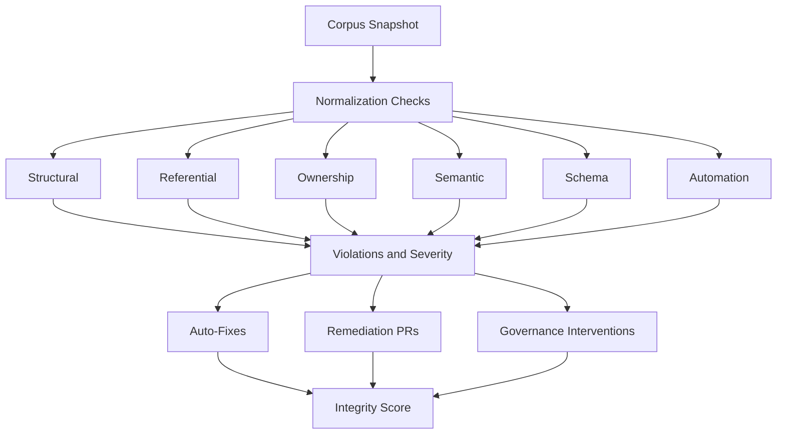

# UIAO Governance Corpus Normalization Enforcement Dashboard (Visual)

## Visual Monitoring of Normalization Violations, Enforcement Actions, and Integrity

This dashboard provides a visual, real-time view of normalization enforcement across the corpus.

---

## 1. Purpose

To give governance operators a single pane of glass for monitoring normalization health, tracking enforcement actions, and identifying hotspot owners and appendices.

---

## 2. Architecture Diagram

---

## 3. Dashboard Panels

### A. Normalization Integrity Score

- 0-100 composite score
- Color-coded band (green 90-100, yellow 75-89, orange 60-74, red below 60)
- 30-day trend line with annotation for major enforcement events

### B. Violations by Type

| Type | Metrics |
|------|---------|
| Structural | Count, severity distribution, top affected appendices |
| Referential | Count, broken ID pairs, resolution rate |
| Ownership | Count, inactive owners, reassignment queue |
| Semantic | Count, non-canonical values, normalization rate |
| Schema | Count, deprecated fields, version mismatches |
| Automation | Count, CI/webhook/workflow misalignments |

### C. Enforcement Actions

| Action Type | Metrics |
|-------------|---------|
| Auto-fixes | Applied count, success rate, revert rate |
| Remediation PRs | Open, merged, overdue |
| Governance interventions | Triggered, resolved, pending |

### D. Hotspots

- Top 5 appendices by violation density (violations per document)
- Top 5 owners by violation impact (weighted severity score)

---

## 4. Update Frequency

| Check Type | Refresh Rate |
|------------|--------------|
| Structural, referential, semantic, schema | Hourly |
| Ownership | Daily |
| Automation alignment | Every 5 minutes |
| Integrity score | After each enforcement cycle |

---

## 5. Interactions

| Interaction | Result |
|-------------|--------|
| Click violation type | Open detailed violation list with document links |
| Click appendix | Open focused normalization report for that appendix |
| Click owner | Open owner normalization profile |
| Hover integrity score | Show breakdown by violation type and severity contribution |
| Click enforcement action | Open action detail with linked PR or intervention record |

> **SSOT Reference:** See /ssot/UIAO-SSOT.md
