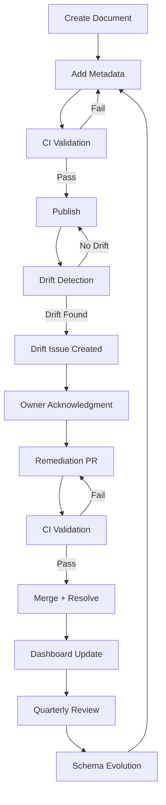

# UIAO Metadata Lifecycle Diagram

## End-to-End Flow from Document Creation to Schema Evolution

---

## Mermaid Diagram



---

## ASCII Diagram

```
Create --> Metadata --> CI --> Publish
                    |
                    Fail --> back to Metadata

Publish --> Drift Detection --> No Drift --> Publish
                            |
                            Drift --> Issue --> Acknowledge --> Remediate --> CI --> Merge --> Dashboard --> Quarterly Review --> Schema Evolution --> Metadata
```
