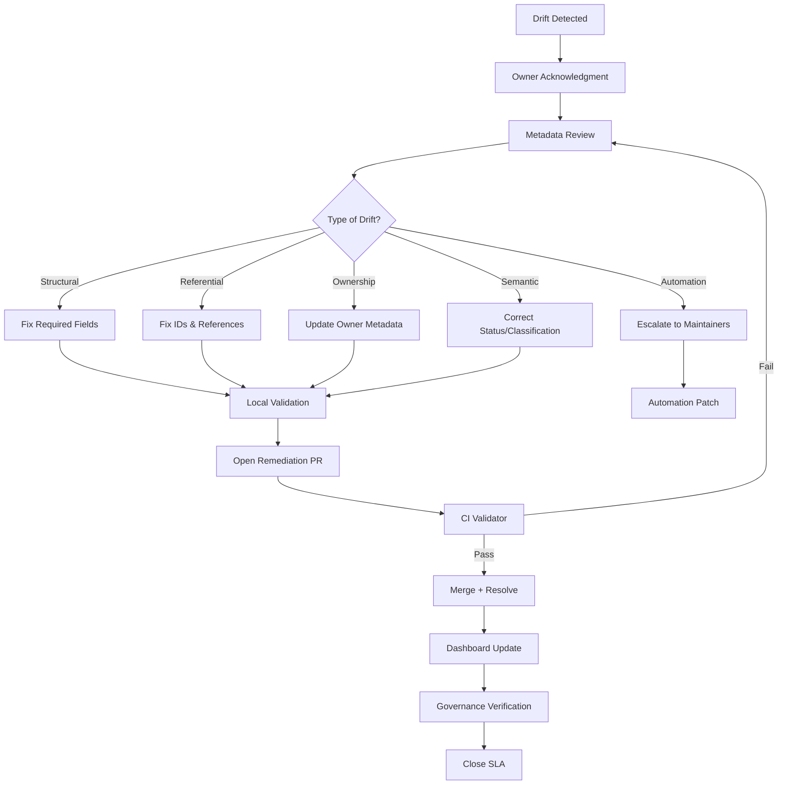

# UIAO Metadata Quality Remediation Workflow Diagram

## Visual Flow from Drift Detection to SLA Resolution

---

## Mermaid Diagram



---

## ASCII Diagram

```
Drift --> Acknowledge --> Review --> Classify
         |-> Structural --> Fix fields
         |-> Referential --> Fix IDs/refs
         |-> Ownership --> Update owner
         |-> Semantic --> Correct status
         |-> Automation --> Escalate

Fix --> Validate --> Remediation PR --> CI --> Merge --> Dashboard --> Governance --> Close SLA
```
