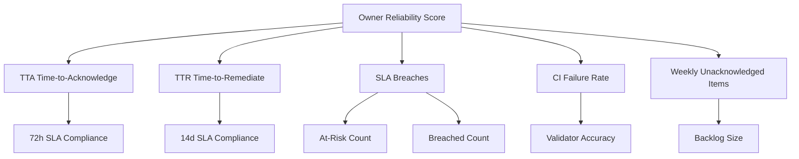

# UIAO Governance Reliability Score Decomposition Diagram

## Visual Breakdown of Owner Reliability Score Components

---

## Mermaid Diagram



---

## ASCII Diagram

```
          Owner Reliability Score
      /        |         |         |         |
   TTA        TTR    SLA Breaches  CI Fail  Weekly Unacked
    |           |      /      |      |           |
 72h SLA    14d SLA  At-Risk Breach Accuracy  Backlog
```

---

## Component Definitions

### TTA - Time to Acknowledge

Measures how quickly owners acknowledge drift issues. Target: within 72 hours.

### TTR - Time to Remediate

Measures how quickly owners remediate acknowledged drift. Target: within 14 days for critical issues.

### SLA Breaches

Counts of at-risk and breached SLA items attributed to this owner.

### CI Failure Rate

Percentage of CI validator failures linked to documents owned by this owner.

### Weekly Unacknowledged Items

Backlog of unacknowledged drift items accumulated week-over-week.
