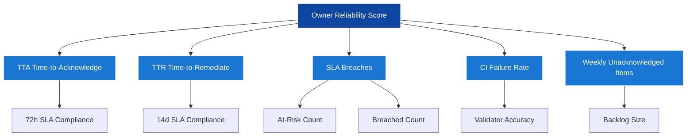

# UIAO Governance Reliability Scorecard (Visual)

## Visual Representation of Owner Reliability Score Components

---

## Mermaid Diagram



---

## ASCII Scorecard

```
+---------------------------+
| OWNER RELIABILITY SCORE   |
+------+------+-------+-----+------+
|  TTA |  TTR |  SLA  |  CI | Unack|
|      |      |Breach | Fail|Items |
+------+------+-------+-----+------+
| 72h  | 14d  |At-Risk|Accur|Backlog
| SLA  | SLA  |Breach |     |      |
+------+------+-------+-----+------+
```

---

## Scoring Rules

| Component | Weight | Green | Yellow | Red |
|-----------|--------|-------|--------|-----|
| TTA (72h) | 25% | >95% | 80-95% | <80% |
| TTR (14d) | 25% | >90% | 75-90% | <75% |
| SLA At-Risk | 20% | 0 | 1-2 | >2 |
| SLA Breached | 20% | 0 | 1 | >1 |
| CI Failures | 5% | <1% | 1-3% | >3% |
| Unacked Items | 5% | 0 | 1-3 | >3 |

> **SSOT Reference:** See /ssot/UIAO-SSOT.md
