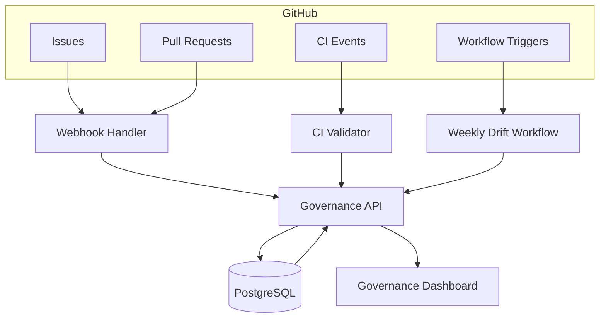

# UIAO Governance Runtime Failure-Mode Dependency Graph

## How Failures Propagate Across the Governance Runtime

---

## Mermaid Diagram



---

## Failure Mode Annotations

### Webhook Handler Failure

- Event Loss: Missing SLA Updates
- Mislabeling: Wrong severity/SLA state applied

### CI Validator Failure

- Misclassification: Incorrect Drift Detection
- Outdated schema: Drift undetected

### Workflow Crash

- Undetected Drift: Weekly report missing

### DB Write Error

- SLA/Drift State Corruption

### Dashboard Stale Data

- Incorrect Governance Decisions

---

## ASCII Diagram

```
GitHub --> Webhook --> API --> DB --> Dashboard
     |--> CI --------^
     |--> Workflow --^

Failure Modes:
- Webhook loss       --> SLA timers wrong
- CI misclassify     --> Drift undetected or false drift
- Workflow crash     --> Weekly drift missing
- DB write failure   --> Corrupted SLA/drift state
- Dashboard stale    --> Incorrect governance decisions
```

> **SSOT Reference:** See /ssot/UIAO-SSOT.md
