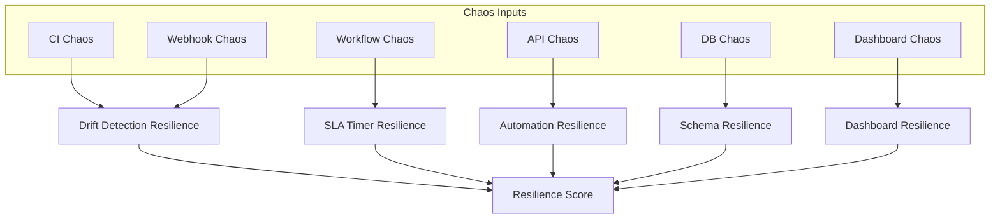

# UIAO Governance Runtime Resilience Dashboard (Visual)

## Visual Dashboard for Monitoring Runtime Stability and Chaos-Resilience

This dashboard provides a visual overview of runtime resilience across CI, workflows, API, DB, and dashboard layers.

---

## 1. Purpose

To give governance operators a single-pane view of how the runtime behaves under chaos conditions, surfacing resilience scores for each layer and triggering intervention when resilience degrades.

---

## 2. Architecture Diagram

---

## 3. Dashboard Panels

### A. Chaos Injection Status

- Active chaos tests and their target layers
- Failure types injected (latency, packet loss, process kill, disk full)
- Impact radius (number of documents and owners affected)

### B. Drift Detection Resilience

- Drift detection latency under chaos conditions
- Drift accuracy under chaos (percentage of true drift events detected)
- Drift event loss probability during chaos injection

### C. SLA Timer Resilience

- SLA timer accuracy under chaos (timer drift in seconds)
- SLA drift alerts triggered by chaos
- SLA cascade probability score

### D. Automation Resilience

- CI validator pass rate under chaos
- Webhook event delivery rate under chaos
- Workflow success rate under chaos

### E. Schema Resilience

- Schema divergence rate under chaos
- Deprecated field reappearance frequency
- Schema version fragmentation index

### F. Dashboard Resilience

- Dashboard data freshness under chaos
- Panel render failure rate
- Alert delivery latency

### G. Composite Resilience Score

    Resilience = 100 - (ChaosImpact x SeverityWeight)

Where SeverityWeight is highest for drift detection and SLA timer layers.

---

## 4. Update Frequency

| Metric Category | Refresh Rate |
|----------------|--------------|
| Chaos events | Real-time |
| Drift metrics | Real-time |
| SLA metrics | Real-time |
| Automation metrics | Every 5 minutes |
| Schema metrics | Hourly |
| Dashboard resilience | Every 5 minutes |

---

## 5. Governance Actions

| Resilience Signal | Action |
|-------------------|--------|
| Drift detection resilience < 80 | Patch CI validator immediately |
| SLA timer resilience < 90 | Patch SLA timer service |
| Automation resilience < 85 | Patch webhook handler and workflows |
| Schema resilience < 90 | Force schema normalization sprint |
| Composite score < 75 | Trigger systemic resilience review |

> **SSOT Reference:** See /ssot/UIAO-SSOT.md
