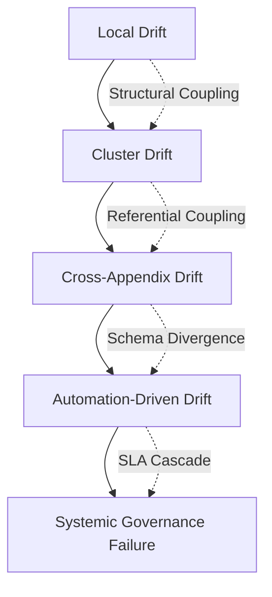

# UIAO Governance Systemic-Risk Propagation Engine (Visual)

## Visual Architecture of How Governance Failures Spread Across the Runtime

This diagram visualizes the Systemic-Risk Propagation Engine (SRPE), showing how drift, SLA stress, schema divergence, and automation instability propagate into systemic governance failures.

---

## 1. Purpose

To provide a visual reference for understanding how governance failures originating at the local level cascade through structural, referential, schema, and SLA coupling channels into systemic failures.

---

## 2. Mermaid Diagram

---

## 3. Propagation Stages

- Local Drift: Isolated field-level or structural violations in a single document
- Cluster Drift: Drift spreading to related documents through structural coupling
- Cross-Appendix Drift: Propagation across ownership boundaries via referential coupling
- Automation-Driven Drift: Schema divergence triggering automated enforcement failures
- Systemic Governance Failure: Full corpus integrity breakdown with SLA cascade

---

## 4. Coupling Types

| Coupling Type | Description |
|---------------|-------------|
| Structural Coupling | Shared schema fields that propagate schema violations |
| Referential Coupling | Cross-document ID references that propagate integrity failures |
| Schema Divergence | Schema version fragmentation accelerating drift spread |
| SLA Cascade | SLA breaches triggering escalation across owners |

---

## 5. Governance Controls

- Schema version pinning to prevent divergence
- CI validator hardening to catch propagation early
- Workflow resilience to maintain automation under chaos
- Owner reassignment when reliability trend declines
- Systemic drift intervention at Cluster Drift stage

> **SSOT Reference:** See /ssot/UIAO-SSOT.md
