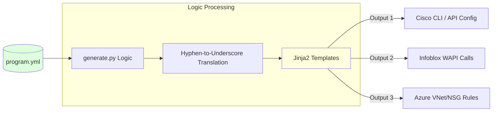
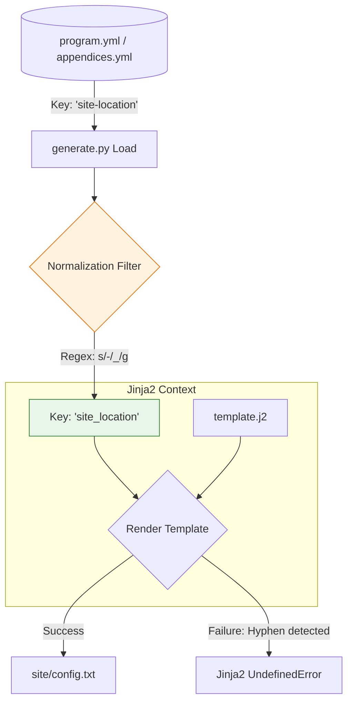
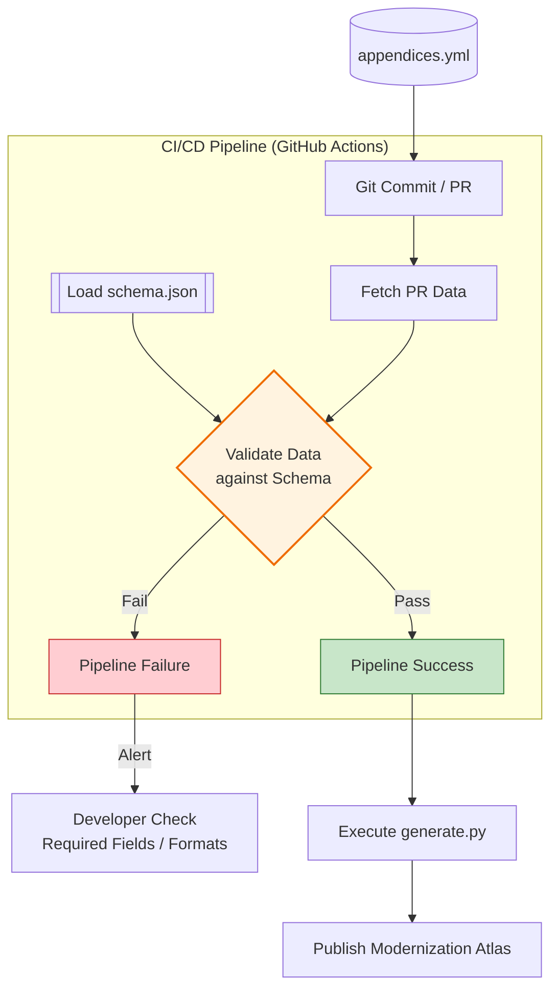

# Pipeline Logic & Data Normalization

The **uiao-core** repository functions as a compiler for infrastructure. It translates high-level intent defined in YAML into vendor-specific configurations and documentation.

## The Data Pipeline
How `program.yml` becomes a deployed configuration:

Mermaid source

Mermaid source

Mermaid source

## The Normalization Engine

The `generate.py` script performs a critical translation step. YAML keys in the canon use hyphens (e.g., `A-01`, `site-location`) for readability, but Jinja2 template variables cannot contain hyphens. The `normalize_key()` filter converts all hyphens to underscores at load time.

Mermaid source

Mermaid source

Mermaid source

### Key Pipeline Steps

1. **Load** — All YAML files from `data/` are read into a unified context dictionary.
2. **Normalize** — Hyphenated keys are converted to underscore format for Jinja2 safety.
3. **Render** — Each `.j2` template is rendered with the full context, producing Markdown files in `docs/`.
4. **Build** — MkDocs compiles the Markdown into a static site with Material theme.
5. **Deploy** — GitHub Actions pushes the built site to GitHub Pages.

### Schema Validation
Before any rendering occurs, the CI/CD pipeline validates `appendices.yml` against `schema.json`:

Mermaid source

Mermaid source

Mermaid source

