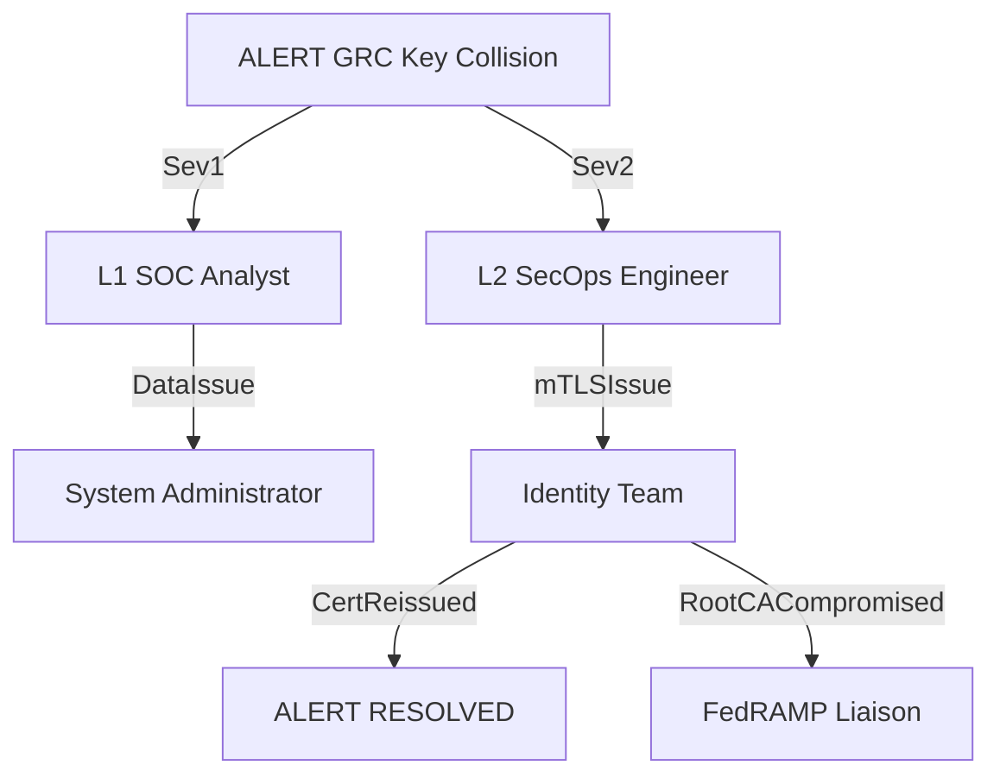

# Operational Handover: Modernization Atlas (V1.0)

**Subject:** Secure Orchestration & Automated Enforcement SOPs  
**Audience:** Tier 1/2 SecOps, Identity Engineers, and Network Defense Team

---

## SOP 1: Monitoring Orchestrator Health

The Atlas lives in the intersection of GitHub Actions, Sentinel, and the Management Plane.

- **Orchestrator Health:** Monitor the `Atlas-Orchestrator-Heartbeat` alert in Sentinel. A failure to receive a "success" signal within 4 hours triggers a **P2 incident**.
- **GitHub Actions Dashboard:** Review the [Actions tab](https://github.com/WhalerMike/uiao-core/actions).
  - **Green:** All systems operational.
  - **Red:** Investigate the `Sync-Orchestrator` run logs for API timeouts or credential failures.
- **Log Verification:** Check the **MS Teams #Atlas-Operations** channel for "Sync Summary" Adaptive Cards. Lack of a daily report indicates a pipeline stall.

---

## SOP 2: Handling False Positives from KQL Alerts

If a valid user is incorrectly flagged as a "Leaver" or "Non-Compliant":

1. **Validate Identity Source:** Cross-check the HRIS status and Entra ID `accountEnabled` attribute.
2. **Verify Device Compliance:** Check the Intune portal for the specific non-compliance reason.
3. **Tuning the KQL:** Add the specific user or device ID to the `watchlist_atlas_exceptions` list in Sentinel.

---

## SOP 3: Manual Override Procedures

In the event of an "Automation Storm" or a critical executive exclusion:

- **ServiceNow `Atlas_Ignore` Tag:** Add `Atlas_Ignore: True` to the CI or User Record to prevent Atlas management.
- **Emergency Kill-Switch (GitHub):** Disable the `enforcement_orchestrator.yml` workflow in GitHub Actions.
- **Manual Restoration:** Use the `NetworkEnforcer` script with `--action remove` or manually delete the IP from the `Atlas_Quarantine_High_Risk` DAG.

---

## SOP 4: Escalation Paths

| Tier | Responsibility | Trigger Condition |
|------|---------------|-------------------|
| Tier 1 (SOC) | Initial Triage & Verification | Any Sentinel Atlas Alert or Teams Notification failure |
| Tier 2 (Eng) | Logic & API Troubleshooting | Pipeline failures, script errors, or persistent false positives |
| Tier 3 (Lead) | Strategic Override / CISO Liaison | Broad network isolation events or suspected compromise of Atlas |

### Escalation Flow Diagram

Mermaid source

Mermaid source

Mermaid source

---

## SOP 5: Runbook for Failure Scenarios

| Scenario | Immediate Action | Resolution Path |
|----------|-----------------|----------------|
| Credential Expiry | Check GitHub Secrets for expired API keys | Rotate keys in Vault; update GitHub Secrets |
| API Timeout | Verify network connectivity to `.servicenowservices.gov` | Check for TIC/VPN outages; retry GitHub Action |
| Rate Limiting | Check API usage logs | Increase polling intervals in canon YAML |
| Orchestrator Crash | Check scripts for syntax errors | Review most recent Git commit; rollback if necessary |

---

## Closing Protocol

SecOps must review the **Atlas Sync Report** during the daily morning briefing. Any "Failed" counts require an immediate root-cause analysis (RCA) before the next scheduled sync.
