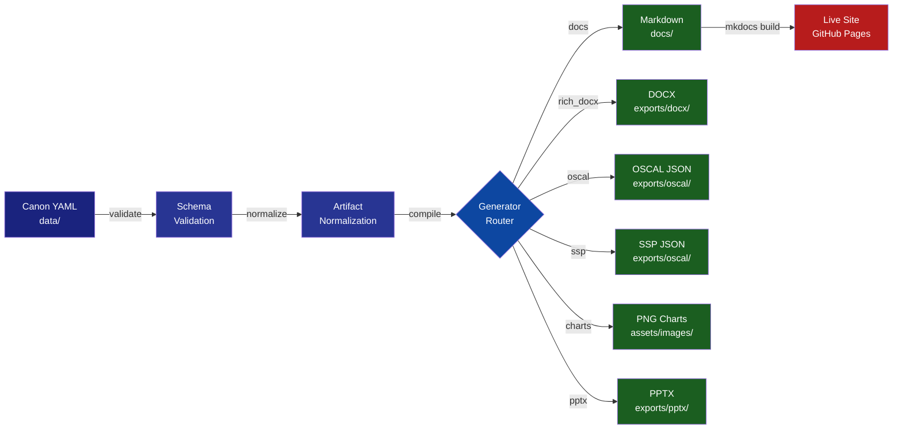
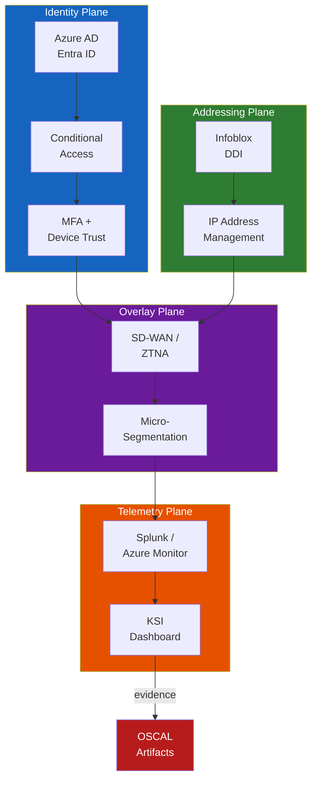

# UIAO Generation Pipeline

> **ADR-0005 Rationale:** Add a dedicated pipeline documentation page with live
> Mermaid rendering to give agency reviewers an interactive, visual overview of
> the UIAO document-compilation workflow. Material for MkDocs + `pymdownx.superfences`
> handles client-side Mermaid rendering with zero extra plugins.

## Pipeline Overview

The UIAO Document Compiler transforms canon YAML data through a multi-stage
pipeline, producing compliance-ready artifacts in Markdown, DOCX, PDF, PPTX,
and OSCAL JSON formats.

Mermaid source

Mermaid source

Mermaid source

## Stage Details

### 1. Schema Validation

All canon YAML files in `data/` are validated against JSON schemas in
`schemas/`. This ensures structural correctness before any generation begins.

### 2. Artifact Normalization

Data is merged, cross-referenced, and ordered into canonical form. Control
plane mappings, compliance matrices, and KSI categories are resolved.

### 3. Generator Router

The Typer CLI (`uiao generate`) dispatches to the appropriate generator based
on the requested output format:

| Generator | Output | Location |
|-----------|--------|----------|
| `docs` | Jinja2 Markdown | `docs/` |
| `rich_docx` | Styled DOCX | `exports/docx/` |
| `oscal` | Component Definition JSON | `exports/oscal/` |
| `ssp` | SSP Skeleton JSON | `exports/oscal/` |
| `charts` | Compliance PNG charts | `assets/images/` |
| `pptx` | Leadership briefing PPTX | `exports/pptx/` |

### 4. MkDocs Publish

Generated Markdown and exported artifacts are served via MkDocs Material on
GitHub Pages, providing an always-current agency-facing dashboard.

## Zero-Trust Architecture Flow

Mermaid source

Mermaid source

Mermaid source

---

*This page is auto-generated as part of the UIAO Document Compiler pipeline.*
