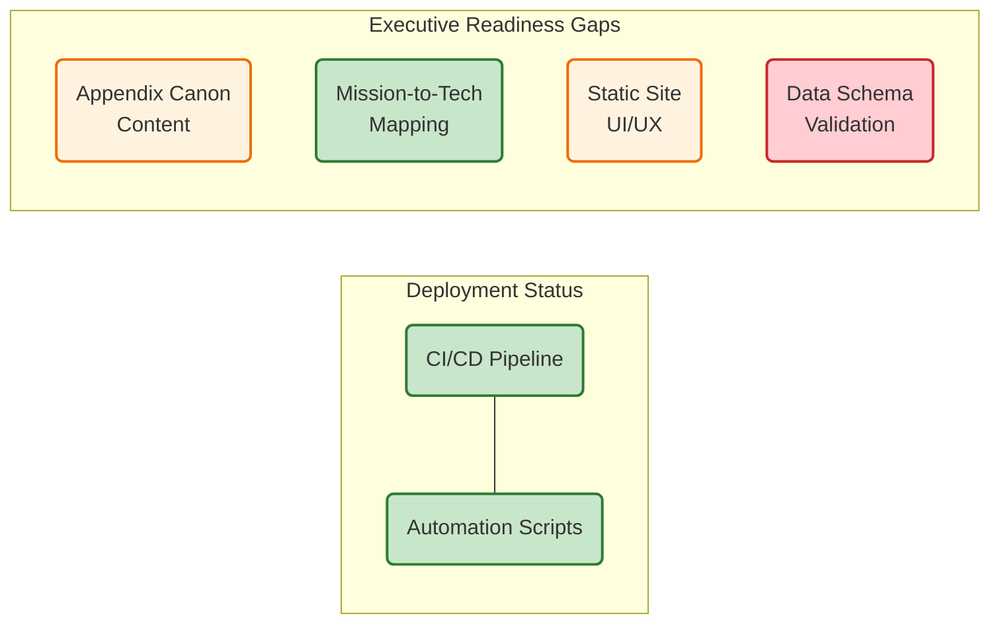

# Implementation Roadmap & Project Status

The modernization of the agency's datacenter is a multi-phase journey. We are currently moving through Phase 1 (Foundations), with subsequent phases building on this core.

## High-Level Roadmap


<details>
<summary>Mermaid source</summary>


<details>
<summary>Mermaid source</summary>


<details>
<summary>Mermaid source</summary>


<details>
<summary>Mermaid source</summary>


<details>
<summary>Mermaid source</summary>


<details>
<summary>Mermaid source</summary>


<details>
<summary>Mermaid source</summary>


<details>
<summary>Mermaid source</summary>


<details>
<summary>Mermaid source</summary>


<details>
<summary>Mermaid source</summary>


<details>
<summary>Mermaid source</summary>

```mermaid
graph LR
  Start(Project Kickoff) --> P1
  subgraph P1[PHASE 1 (Foundations)]
      direction TB
      M1[CI/CD Workflow Optimized]
      M2[generate.py Initialized]
      M3[Core Appendices A-G Drafted]
      style P1 fill:#e3f2fd,stroke:#1565c0,stroke-width:2px;
  end
  P1 --> Milestone1{Q4 2025: Atlas Live}
  Milestone1 --> P2
  subgraph P2[PHASE 2 (Plane Integration)]
      direction TB
      M4[Identity & Addressing Plane Linked]
      M5[Splunk Telemetry Anchored]
      M6[Security Appendices BA-BZ Drafted]
      style P2 fill:#fff3e0,stroke:#ef6c00,stroke-width:2px;
  end
  P2 --> Milestone2{Q2 2026: End-to-End Visibility}
  Milestone2 --> P3
  subgraph P3[PHASE 3 (Overlay & Scale)]
      direction TB
      M7[SDA Fabric Automation Deployed]
      M8[Full GitOps Integration]
      M9[Operational Appendices CA-CZ Drafted]
      style P3 fill:#c8e6c9,stroke:#2e7b32,stroke-width:2px;
  end
  P3 --> Milestone3{Q4 2026: Executive Ready & Modernized}
  classDef milestone fill:#f9f,stroke:#333,stroke-width:1px;
  class Milestone1,Milestone2,Milestone3 milestone;
```

</details>

</details>

</details>

</details>

</details>

</details>

</details>

</details>

</details>

</details>

</details>

## Current Execution Status
This "Stoplight" dashboard represents the real-time health of our development and documentation pipeline.


<details>
<summary>Mermaid source</summary>


<details>
<summary>Mermaid source</summary>


<details>
<summary>Mermaid source</summary>


<details>
<summary>Mermaid source</summary>


<details>
<summary>Mermaid source</summary>


<details>
<summary>Mermaid source</summary>


<details>
<summary>Mermaid source</summary>


<details>
<summary>Mermaid source</summary>


<details>
<summary>Mermaid source</summary>


<details>
<summary>Mermaid source</summary>


<details>
<summary>Mermaid source</summary>



</details>

</details>

</details>

</details>

</details>

</details>

</details>

</details>

</details>

</details>

</details>

### Remaining Milestones

* **Q4 2025:** Modernization Atlas v1.0 Live (Foundation).
* **Q2 2026:** End-to-End Plane Visibility (Integration).
* **Q4 2026:** Full Executive Readiness & Operational Modernization (Scale).