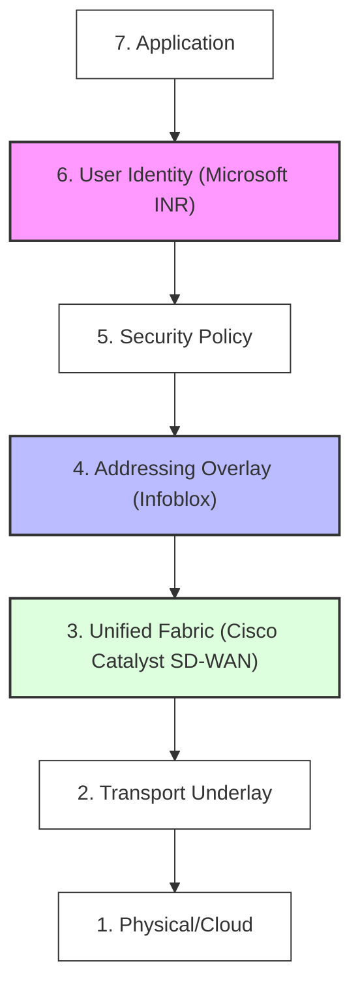

# The UIAO Seven-Layer Model

This model defines the architectural stack for the modernization efforts at Unified Identity-Addressing-Overlay Architecture. Each layer represents a functional domain, and the three UIAO pillars (Identity, Addressing, Overlay) are highlighted to show where vendor-specific integration occurs.

---

## Layer Descriptions

### Layer 7: Application

Business logic and user interface

### Layer 6: User Identity

**Vendor:** Microsoft INR | **Pillar:** Identity

### Layer 5: Security Policy

Policy enforcement and trust boundaries

### Layer 4: Addressing Overlay

**Vendor:** Infoblox | **Pillar:** Addressing

### Layer 3: Unified Fabric

**Vendor:** Cisco Catalyst SD-WAN | **Pillar:** Overlay

### Layer 2: Transport Underlay

Physical and Cloud ISP transport

### Layer 1: Physical/Cloud

Hardware and Hyperscale substrates

---

*End of Seven-Layer Model v1.0*