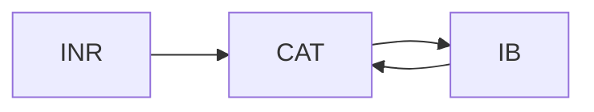

# UIAO Unified Architecture  
**Version 1.0**

---

# Architectural Overview
The Unified Identity-Addressing-Overlay Architecture (UIAO) is a modernization initiative designed to unify identity, addressing, routing, telemetry, and governance into a coherent, Zero Trust-aligned federal architecture. It integrates Microsoft Entra ID as the identity control plane, ICAM as the governance backbone, InfoBlox as the authoritative IPAM, Cisco SD-WAN as the routing control plane, and cloud-native telemetry and location services as the truth source for operational decisions. Together, these components form a coordinated modernization effort that replaces fragmented legacy systems with a cloud-optimized, identity-driven, telemetry-informed enterprise.
The strategic goal is to transform the agency into a modern federal network where identity is the perimeter, telemetry is the truth, routing is cloud-first, and governance is automated. UIAO provides the architectural foundation needed to meet Zero Trust expectations, TIC 3.0 requirements, and FedRAMP-aligned controls while improving mission performance and citizen experience.

# Core Stack Integration

The following diagram illustrates how the three pillars of the UIAO framework interconnect. Each node is dynamically generated from program.yml and styled using validated classDef syntax.

---

# The Five Control Planes

### 1. Identity Control Plane
The Identity Control Plane is anchored in Entra ID and reinforced by ICAM governance, Conditional Access, Privileged Identity Management, and lifecycle automation. Identity becomes the authoritative source for access, addressing, certificates, and policy.

### 2. Network Control Plane
The Network Control Plane uses Cisco SD-WAN to deliver cloud-first routing, performance-optimized paths for M365, and identity-aware segmentation. Integration with INR enables location-aware routing and emergency services readiness.

### 3. Addressing Control Plane
The Addressing Control Plane modernizes IPAM through InfoBlox, replacing spreadsheets with authoritative, identity-derived addressing. DNS and DHCP are unified across cloud and on-prem environments, enabling consistent policy enforcement and accurate telemetry correlation.

### 4. Telemetry & Location Control Plane
The Telemetry and Location Control Plane consolidates signals from M365, SD-WAN, endpoints, DNS, CDM/CLAW, and SIEM platforms. Telemetry becomes a real-time control input for routing, security, and compliance, enabling conversation-level visibility across the enterprise.

### 5. Security & Compliance Plane
The Security and Compliance Plane aligns the architecture with TIC 3.0, Zero Trust, FedRAMP 22, NIST 800-63, and ICAM governance. Security becomes embedded in the architecture rather than bolted on, with automated enforcement replacing manual review.

---

# The Seven Core Concepts

### 1. Conversation as the Atomic Unit
Every interaction—identity, certificate, addressing, path, QoS, and telemetry—is treated as a single, correlated conversation rather than isolated events.

### 2. Identity as the Root Namespace
Identity becomes the root namespace for all resources, ensuring that every IP address, certificate, subnet, policy, and telemetry event is derived from or bound to identity.

### 3. Deterministic Addressing
Addressing becomes deterministic and policy-driven, replacing ad-hoc assignment with identity-derived logic that enables accurate correlation and automated governance.

### 4. Certificate-Anchored Overlay
Certificates and mutual TLS anchor tunnels, services, and trust relationships across the enterprise.

### 5. Telemetry as Control
Telemetry becomes an active control input for routing, security, and compliance decisions rather than a passive reporting mechanism.

### 6. Embedded Governance & Automation
Governance is executed through orchestrated workflows that enforce policy consistently and reduce operational burden.

### 7. Public Service First
Citizen experience, accessibility, and privacy remain top-level design constraints.

---

# Architectural Rationale
The agency’s current environment is constrained by legacy TIC 2.0 routing patterns that force traffic through centralized bottlenecks, degrading performance and limiting cloud adoption. Identity remains anchored in on-premises Active Directory, creating governance gaps and inconsistent enforcement across divisions. Addressing is fragmented across spreadsheets and disconnected IPAM tools, making it difficult to correlate identity, device, and network activity. Telemetry is incomplete and siloed, preventing conversation-level visibility and limiting the agency’s ability to support INR, E911, or Zero Trust enforcement.
These limitations have direct mission impact. M365 performance is degraded by unnecessary hairpinning. Cyber risk increases when identity governance is inconsistent and telemetry is incomplete. Compliance gaps emerge when the agency cannot meet TIC 3.0, FedRAMP 22, or SCuBA expectations. Operational inefficiencies multiply when governance depends on manual tickets instead of automated workflows. Modernization is required to support mission readiness, cyber resilience, and citizen-facing services.

---

# Vibrant Visualizations

The following high-fidelity visuals provide presentation-grade evidence for audit and leadership review.

### Identity-to-IP Mapping (U+A Pillar)

### Cisco-Microsoft INR Overlay (O Pillar)

### Cryptographic Trust Chain (SC-8)

---

*End of Unified Architecture v1.0*